# Data Genie (GovHack 2025) — ABS Dataset Wizard 🧞‍♂️📊

**Data Genie** is a GovHack prototype that helps people **navigate Australia’s data landscape** by turning a real-world problem into a **step-by-step dataset recommendation + join plan** — like *Akinator*, but for public datasets.

🏅 **GovHack 2025 — Honourable Mention (Australian Bureau of Statistics)**  
Built in ~46 hours as a proof-of-concept to make discovery and reuse of public datasets faster, clearer, and more practical.

---

## What problem are we solving?

Australia has thousands of public datasets across ABS and other sources. People often struggle with:
- **Knowing what dataset to use** for a problem (they “don’t know what they don’t know”)
- Understanding **how to join datasets** (keys, geography levels, compatibility)
- Going from “dataset found” → “analysis started” (code, examples, setup friction)
- Lack of **community signal** (what actually works in real projects)

**Data Genie** reduces that friction by guiding users through smart questions and returning a curated “solution plan”.

---

## What Data Genie does

### 1) Ask a plain-English question
Users describe their goal in normal language (e.g., “I want to open a mobile repair and accessory store”).

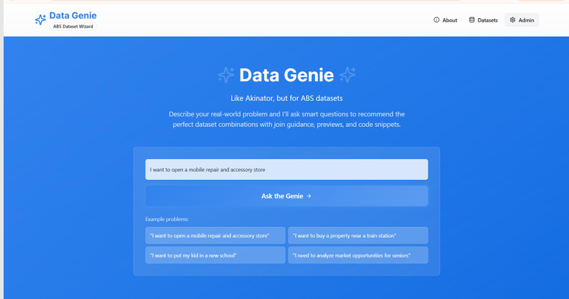

### 2) Smart Questions (guided wizard)
The app asks a short series of targeted questions to clarify the use case:
- Location / SA2 area
- Catchment definition (e.g., 10-min walk vs 10-min drive)
- Audience definition (workers vs residents vs both)
…and more.

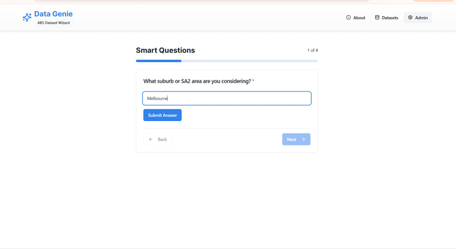  
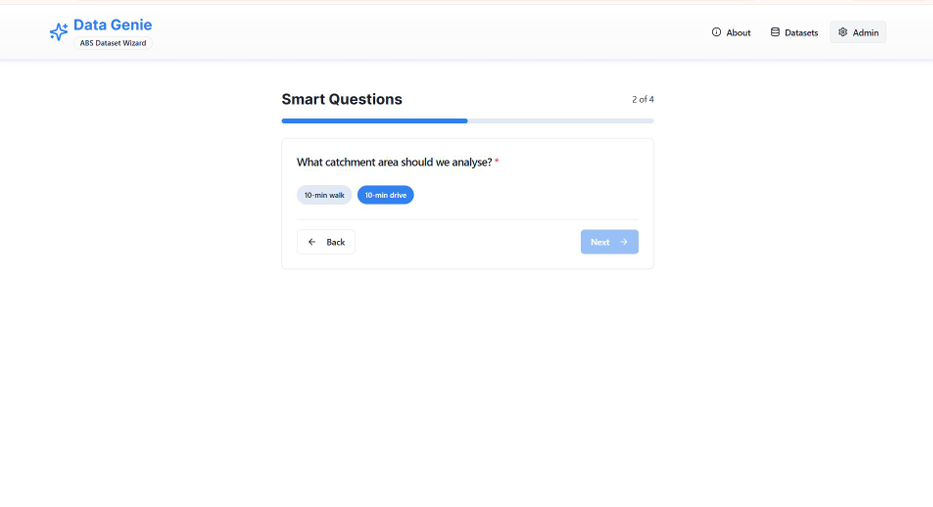  
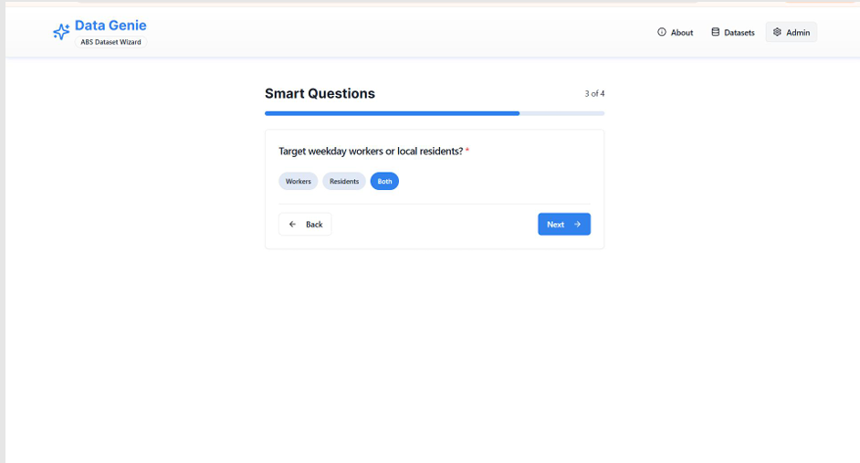

### 3) Generate a “Solution Plan” (recommended datasets + join strategy)
The outcome is a practical plan: recommended datasets, how they connect, and what to do next.

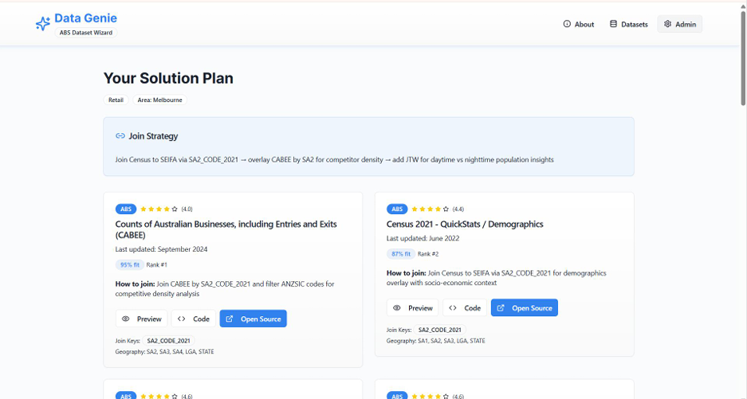  
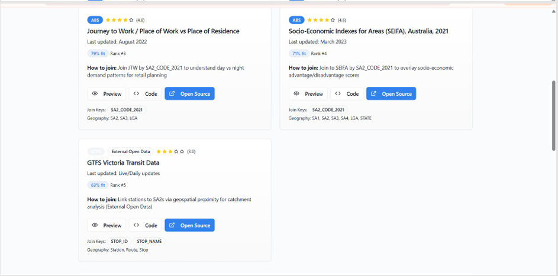

### 4) Dataset cards with “Preview / Code / Open Source”
Each dataset card includes:
- Quick description and quality hints (e.g., “last updated”)
- Suggested join keys (e.g., SA2 codes)
- Geography coverage (SA1/SA2/SA3/LGA etc)
- **Preview** (sample rows / mini graph)
- **Code snippets** (starter code to get moving)

  
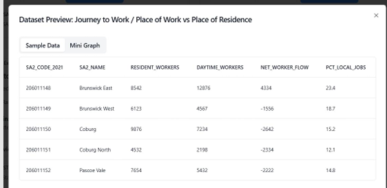  
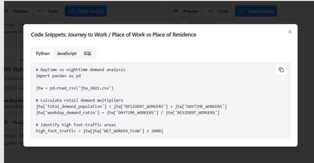

### 5) Community Insights (reviews + success stories)
A community layer that lets people:
- Share what they built
- Leave reviews and notes on what worked / didn’t
- Provide reusable “dataset stacks” for common problems

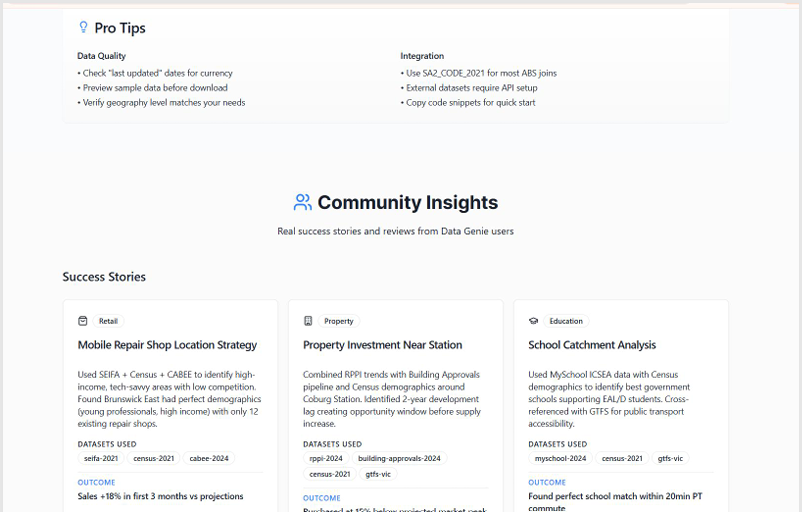  
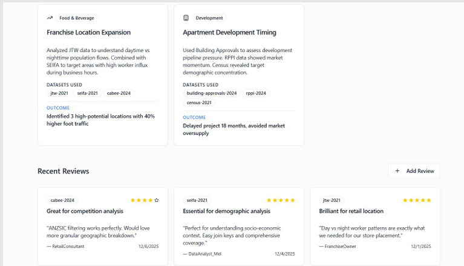

### 6) Admin analytics dashboard (for dataset owners like ABS)
A lightweight admin view to monitor:
- Highest / lowest rated datasets
- Most / least downloaded datasets
- Adoption and dataset performance signals

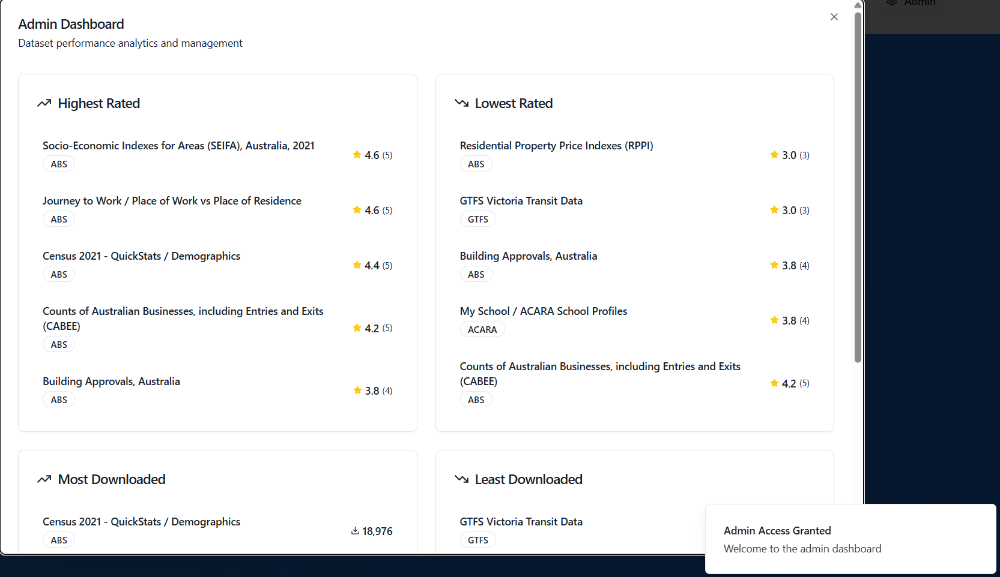  
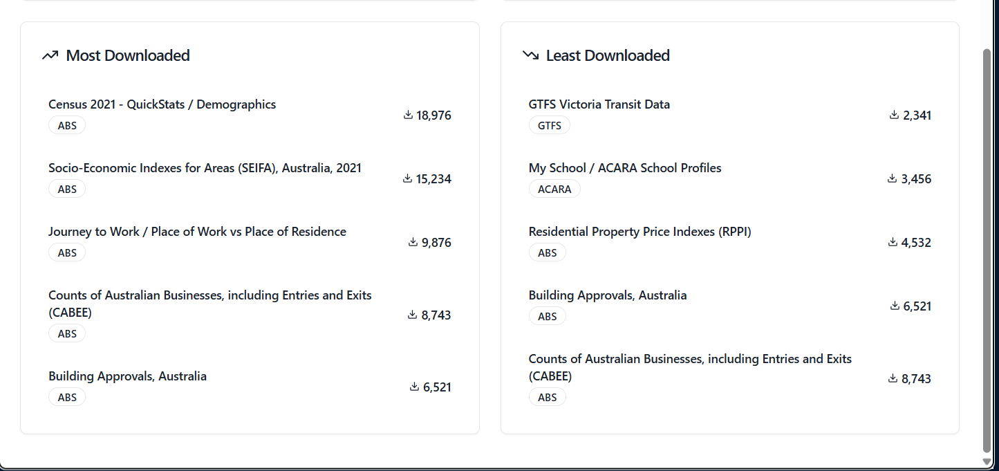

---

## Key features (summary)

- **Natural language → dataset recommendations**
- **Smart-question wizard** to clarify user intent
- **Join guidance** (keys + geography alignment hints)
- **Dataset previews** to validate before download/use
- **Copy-ready code snippets** (Python / JavaScript / SQL)
- **Community reviews + success stories** to build trust and reuse
- **Admin dashboard** for visibility into dataset engagement

---

## Example outcomes (what users get)

Depending on the use case, Data Genie can assemble a plan such as:
- **Retail location strategy** (demographics + business counts + socio-economic context)
- **Property investment insights** (housing prices + approvals + demographics)
- **School catchment analysis** (schools + transport + demographics)

Each plan is designed to be “actionable” — not just “here’s a dataset”, but “here’s how to use it together”.

---

## Data sources (as shown in the prototype)

The prototype demonstrates integration patterns across:
- **ABS** datasets (e.g., Census QuickStats, SEIFA, business counts, etc.)
- External datasets like **GTFS transit** for transport proximity use-cases
- **ACARA / My School** for education-related use-cases

(Exact datasets vary based on the user’s answers and scenario.)

---

## Project structure

This repo contains the GovHack prototype and supporting materials.

Recommended additions:

- `images/` (screenshots used in this README)

---

## Roadmap (next improvements)

- Stronger dataset metadata indexing + search
- More robust join validation (schema checks, geo-level compatibility)
- Better “explainability” for recommendations (why these datasets)
- Auth + moderation for community contributions
- Export solution plan as a shareable report (PDF/Markdown)
- Public demo deployment + API documentation

---

## Team

**Data Mafia** — GovHack 2025  

---

## Acknowledgements

- **GovHack** community and organisers  
- **Australian Bureau of Statistics (ABS)** and open data providers  
- Everyone building with public data in Australia

---
